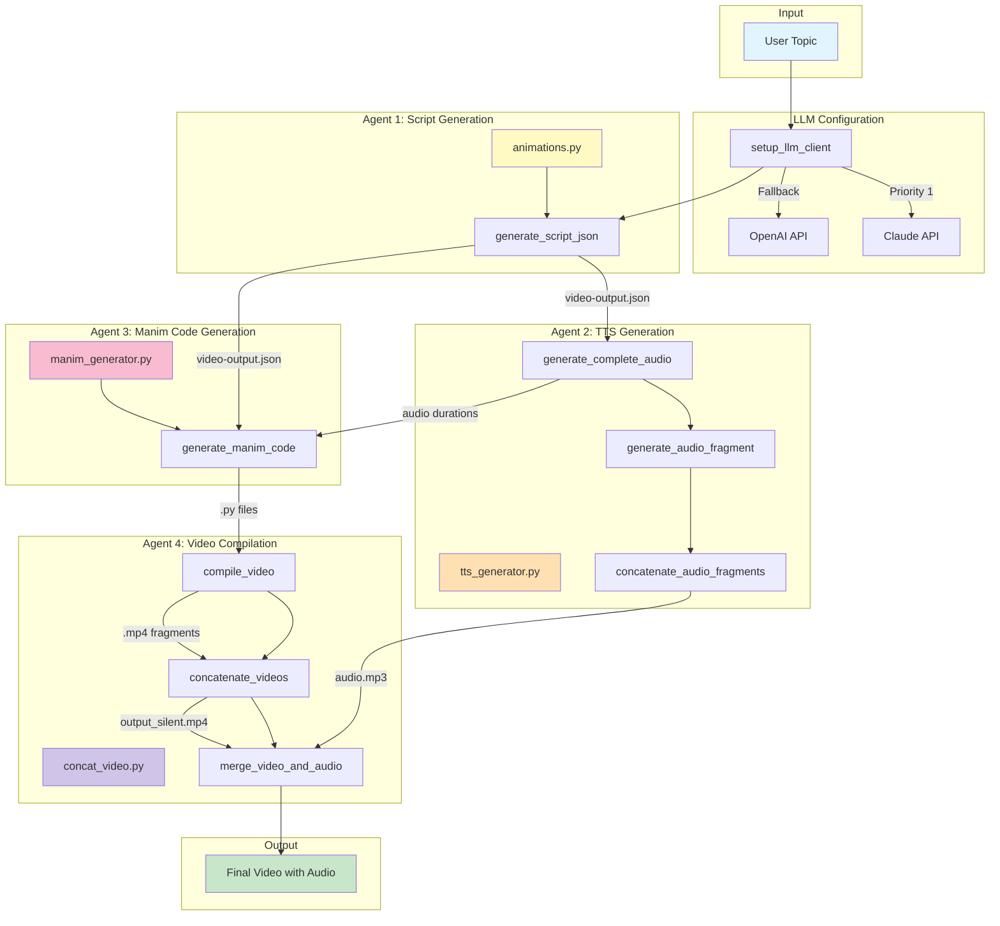

<div align="center"> 
 

# Explainify 
</div> 

**Explainify** – Type any topic, get a narrated educational animation in minutes. Built for neurodivergent learners who absorb information better through visuals and audio. 

<div align="center"> 

## Demo 
 

</div> 

--- 

## 🎬 Generated Video Example 

A real video Explainify produced for the topic *"How do machines learn to recognize MNIST dataset numbers?"* — storyboard → Manim animation → narration → final MP4.

<div align="center">
  
</div>


---

## 🧠 The Problem

Most educational content is text‑heavy and static.  
For neurodivergent learners (ADHD, dyslexia, autism), this creates friction:

- Too much text → cognitive overload  
- Abstract concepts → hard to visualize  
- One‑size‑fits‑all explanations → don't always click  

**Explainify changes that.**

---

## ✨ How It Works

1. **Type any topic** – e.g., *"How does a solar cell work?"*  
2. **AI generates a storyboard** – breaks the topic into scenes with narration.  
3. **Manim animations** – each scene becomes a professional animated visual.  
4. **Natural voiceover** – synced with the animation (audio duration is passed back into the animation prompt so visuals match the narration).  
5. **Comprehension check** *(roadmap)* – after watching, the AI asks one micro‑question to verify understanding.  
6. **Re‑frame loop** *(roadmap)* – on a wrong answer, Explainify picks a new representation strategy (causal diagram, concrete analogy, step‑by‑step) and regenerates the video.

This adaptive loop is **our unique differentiator** – it discovers *how* the learner understands and changes the representation until it clicks.

---

## 🔥 Key Features

| Feature | Description |
|---------|-------------|
| **Multi‑LLM support** | Auto fallback between Claude and OpenAI. |
| **Auto‑storyboard** | AI generates a scene‑by‑scene script with timings. |
| **TTS narration** | Natural voiceover with audio‑duration‑synced animations. |
| **Manim animations** | Professional mathematical and scientific visualizations. |
| **Code repair loop** | Generated Manim code is auto‑fixed on render errors (up to 3 retries). |
| **Comprehension check** *(roadmap)* | One micro‑question after each video – tests real understanding. |
| **Re‑frame loop** *(roadmap)* | On wrong answer, AI picks a new representation strategy and re‑renders. |
| **Neurodivergent‑friendly** | Low cognitive load, visual‑first, audio‑optional. |

---

## 🏗️ Architecture

Explainify is a multi‑agent pipeline that orchestrates several specialized components:



---

## 📦 Installation

### Prerequisites

- Python 3.11+
- `uv` (fast Python package manager)
- Manim, FFmpeg, LaTeX (all included in Docker)

### Quick start (using Docker – recommended)

```bash
git clone https://github.com/Flowthread/Explainify.git
cd Explainify
docker compose up
```

Then open `http://localhost:5000`.

### Local setup (without Docker)

```bash
# Install uv
curl -LsSf https://astral.sh/uv/install.sh | sh

# Clone and setup
git clone https://github.com/Flowthread/Explainify.git
cd Explainify
uv sync
source .venv/bin/activate   # or .venv\Scripts\activate on Windows
cp .env.example .env

# Start Flask server
python src/main.py
```

Then open your browser and navigate to `http://localhost:5000`.

---

## 🔑 API Keys

Explainify supports **Claude** and **OpenAI** as LLM providers. Configure at least one in `.env`:

```
CLAUDE_API_KEY=your_key        # priority 1 (used in auto mode)
OPENAI_API_KEY=your_key        # fallback; also required for TTS
```

Auto mode uses Claude first, then falls back to OpenAI. You can also force a provider in the UI.

---

## 🎯 Demo Video

Watch a 3‑minute walkthrough (link to be added):  
`https://youtu.be/your-link-here`

---

## 📁 Repository Structure

```
Explainify/
├── src/
│   ├── animations.py          # Storyboard generation
│   ├── manim_generator.py     # Manim code + repair loop
│   ├── tts_generator.py       # TTS narration
│   ├── concat_video.py        # Video + audio merging
│   ├── video_generator.py     # Job orchestration
│   └── main.py                # Flask API server
├── public/                    # Demo GIFs, logos
├── .env.example
├── Dockerfile
├── docker-compose.yml
├── README.md
└── LICENSE (MIT)
```

---

## 📄 License

**MIT License** – free to use, modify, and distribute.

---

## 🙌 Built for IncludAI 2026

Explainify was created for the [IncludAI – Neurodiversity Hackathon](https://includai-2026.devpost.com) as a tool that makes learning accessible through visual and auditory content.

---

## 📬 Contact

- GitHub: [github.com/Flowthread/Explainify](https://github.com/Flowthread/Explainify)
- Issues: [github.com/Flowthread/Explainify/issues](https://github.com/Flowthread/Explainify/issues)
- Developer: [@Flowthread](https://github.com/Flowthread)


